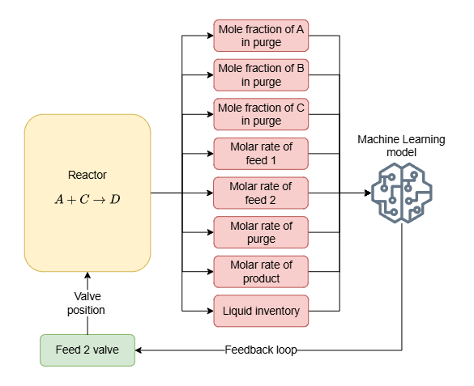
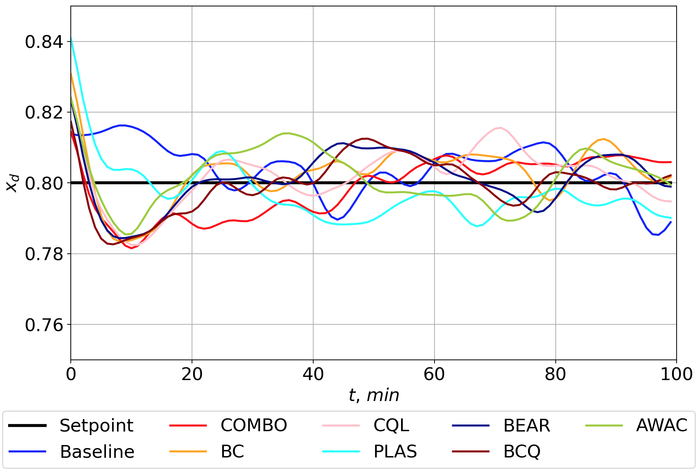
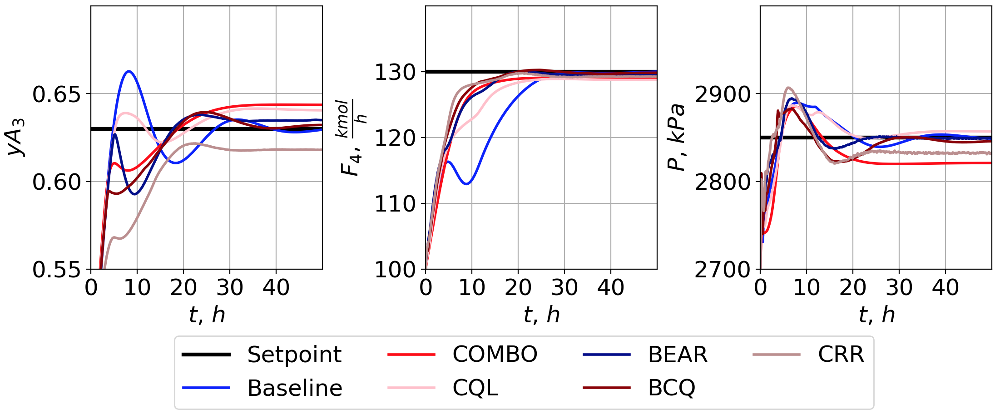

 ## Introduction
This repository presents materials on numerical experiments for the article "IPSim: Industrial Processes Simulator for Benchmarking
Reinforcement Learning-based Control". The experiments are aimed at systematically studying and comparing the performance of traditional industrial process control algorithms and algorithms obtained using reinforcement learning (RL).

The study use flexible Python-based framework for modeling dynamic industrial processes [ipsim](https://github.com/Haridus/ipsim) and a methodology for packaging these models into OpenAI Gym-compatible environments, enabling the integration of reinforcement learning (RL) algorithms. The framework was employed to create simulators for the Exothermic Continuous Stirred-Tank Reactor, a Distillation Column, and the Simplified Tennessee Eastman Process. These simulators facilitated a comparative analysis between traditional PID control algorithms and advanced control strategies derived from both online and offline RL techniques.

The general idea of ​​the framework can be illustrated in the figure. A node-based simulator, using sensor nodes, provides results to an AI algorithm, which can control the process by influencing manipulated variables via input nodes.


## Repository structure
The presented repository has the following structure:
* The __config__ directory contains configuration files with settings for online and offline RL training on the environments used in the study.
* The __control__ directory contains conventional control algorithms in the form adopted for the study.
* The __data__ directory contains a single file with _DC_IndustrialControlAlgorithm_data.csv_ data obtained by using an industrial control algorithm on the DistillationColumn simulator provided by industrial partners.
* The __mgym__ directory contains bindings for obtaining OpenAI gym/gymnasium environments from the industrial process simulators considered in the study, as well as standard settings for the RL algorithms used in the study.
* The __utils__ directory contains various utilities to provide template approach for generating data, working with supplymentary directoryes and others. The _constructors_ script within directory contains methods for creating OpenAI gym/gymnasium compatible environments tools for particular process.
* The root directory contains the main scripts for preparing data for offline training, the training itself both offline and online, scripts for testing the obtained models within the predefined scenarios for each process.
 
## Dependencies
Python 3.9.13 is used for experiments. You will also need git since requirements.txt has links to github projects as dependencies.

The [IPSim](https://github.com/Haridus/ipsim) framework used in the study aims to maintain a minimum number of external dependencies. This work uses proven RL frameworks compatible with the OpenAI gym/gymnasium standard, such as d3rlpy and ray, which themselves contain a large number of dependencies and are sensitive to both the PC environment and the Python environment on which they are executed. Therefore, the dependencies used in the study are collected in the __requirements.txt__ file attached to the repository in the root directory.

The modified SMPL frameword used as basis for wrapping of industrial process simulators to OpenAI gym/gymnasium style enviroments. The base implementation of [SMPL](https://github.com/Mohan-Zhang-u/smpl) doesn't cover all requirement (e.g. proper normalization routines) for the study. Thats why, the our modified SMPL framework already included in __mgym__ directory and don't need explicit import.

## Setup
It is recommended to install all dependencies in a separate [.venv](https://docs.python.org/3/library/venv.html) space using the provided __requirements.txt__ file as follows:

```
> pip install -r requirements.txt
```

Used ray==1.9.1 require torch of particular versions. To properly setup torch use following pip command within used venv:

For Windows
```
> pip install torch==1.10.1 torchvision==0.11.2 torchaudio==0.10.1 --index-url https://download.pytorch.org/whl/cu113 
```

For MacOS:
```
> pip install torch==1.10.1 torchvision==0.11.2 torchaudio==0.10.1
```

## Running experiments
To run training configure particular process .yaml settings file and run coresponding scripts.

### Offline RL 
```
offlineRL_data_generation.py -p @ProcessName@
offlineRL_training.py -p @ProcessName@
```
By default offlineRL_training try all used RL algorithms ('COMBO', 'MOPO', 'AWAC', 'DDPG', 'TD3', 'BC', 'CQL', 'PLAS', 'PLASWithPerturbation', 'BEAR', 'SAC', 'BCQ', 'CRR'). Partifular algorithms can be specified by --algs option of offlineRL_training script.

### Online RL
```
onlineRL_training.py -p @ProcessName@
```
By default offlineRL_training try all used RL algorithms ('ppo', 'sac', 'ars', 'impala', 'a2c', 'a3c'). Partifular algorithms can be specified by --algs option of offlineRL_training script.

## Showing results

### Pretrainted models
To evaluate pretrained models you need place data from [disk](https://drive.google.com/drive/folders/1rTukAjcuvKCRA0lzozWqcSr2EraS6aBm?usp=sharing) to __pretrained__ directory, which needs to be created in the __root__ directory of the current project. You can do this manually or use _load_pretrained_models.py_, which will download models and unzip them to __pretrained__ directory. Just call:
```
load_pretrained_models.py
```
To evaluate offline models call:

```
offline_pretrained_models_assessment.py -p @ProcessName@
```
To evaluate online models call:
```
online_pretrained_models_assessment.py -p @ProcessName@
```

The models assesment scripts also allow specify particular algorithms to show results by --algs option. List of algs coresponds to list in offlineRL_training and onlineRL_training.

### Exothermic Continuous Tank Reactor (ECSTR) result
Exothermic Continuous Tank Reactor (ECSTR) result for offline RL models is presented on image


Exothermic Continuous Tank Reactor (ECSTR) result for online RL models is presented on image


### Distillation Column (DC) result
Distillation Column (DC) result for offline RL models is presented on image


Distillation Column (DC) result for online RL models is presented on image


### Simplified Tennessee Eastman Process (STEP) result
Simplified Tennessee Eastman Process (STEP) result for offline RL models is presented on image
